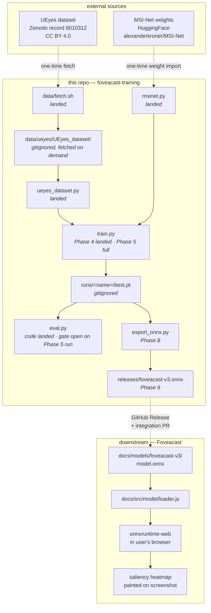

# Architecture

This document describes the end-to-end shape of the training pipeline in this repo and the interface it exposes to its downstream consumer, [Foveacast](https://github.com/khawkins98/Foveacast).

It is forward-looking: most modules mentioned here do not exist in code yet. The goal is to make the target architecture reviewable *before* the code lands so that Phase 2 onwards has a clear frame to build against. Each component has a status marker (**[landed]**, **[next]**, **[later]**) so the gap between plan and reality is visible at a glance.

See [`README.md`](README.md) for how to run the pipeline, [`LEARNINGS.md`](LEARNINGS.md) for the decisions that shaped it, and [issue #1](https://github.com/khawkins98/foveacast-training/issues/1) for the phased plan that gets us there.

---

## Overview

`foveacast-training` is a Python training pipeline whose sole deliverable is a single `.onnx` saliency-prediction model. That artefact is attached to a GitHub Release and consumed by Foveacast — a buildless JS web app — via `onnxruntime-web` in the user's browser. No other output matters; no other output ships.

The model is [MSI-Net](https://github.com/alexanderkroner/saliency) (Kroner et al. 2020, MIT), architecturally reimplemented in PyTorch, its SALICON-pretrained weights imported once from HuggingFace, and fine-tuned on the [UEyes dataset](https://zenodo.org/records/8010312) (Jiang et al. 2023, CC BY 4.0) to produce a saliency predictor that actually knows what a button is.

## Why two repos

Foveacast is a buildless static web app. `foveacast-training` is a GPU-grade Python project that downloads 13 GB of dataset, installs PyTorch, runs for hours, and produces one artefact. Forcing these into one repo would poison Foveacast's "clone, `pnpm install`, `pnpm dev`" promise. Splitting lets each repo keep the dependencies, tooling, and release cadence that match its actual shape.

The boundary between them is the `.onnx` file attached to a GitHub Release tag. Foveacast's integration PR (Phase 10) is the only cross-repo coupling.

## End-to-end data flow

Dashed edges are one-time or release-event flows. Solid edges are per-training-run data dependencies inside this repo or per-page-load flows inside Foveacast.

## Module responsibilities

The `src/foveacast_training/` package is deliberately small — five modules plus `__init__.py`. Each has one job. None of them depend on the others beyond what this table shows.

| Module              | Status     | Responsibility                                                                                 | Depends on                   |
|---------------------|------------|-----------------------------------------------------------------------------------------------|------------------------------|
| `__init__.py`       | **landed** | Package marker and `__version__`.                                                             | —                            |
| `msinet.py`         | **landed** | PyTorch reimplementation of Kroner's MSI-Net: VGG16 encoder (last two maxpools dropped, last block dilated) + ASPP (dilations 1/4/8/12 + global average pooling) + 3-block bilinear-upsample decoder. Mean subtraction baked into `forward()`. Bilinear upsamples use a custom `_tf1_bilinear_upsample` helper that reproduces TF 1.x `ResizeBilinear(align_corners=False, half_pixel_centers=False)` — neither PyTorch `F.interpolate` mode matches this. Weight import lives at `scripts/import_msinet_weights.py` (gated by the `[weights-import]` extras); parity test at `tests/test_msinet_parity.py` passes at `atol=1e-5` with observed residual ~1e-7 mean. | `torch`, `torchvision`       |
| `ueyes_dataset.py`  | **landed** | PyTorch `Dataset` wrapping `data/ueyes/UEyes_dataset/`. Parses `image_types.csv` (CRLF-aware, keeps the Excel-quirky `Block` column as a string), honours the upstream train/test split, carves a stratified 10% validation hold-out from train with fixed seed (42, ~47 per category × 4). Loads PNG/JPG/JPEG stimuli via PIL (unconditional RGB convert handles the handful of `mode=L` outliers) and matching `saliency_maps/heatmaps_3s/` ground truth; saliency variant configurable. Resize + pad to (240, 320) via PIL BICUBIC with Kroner's constant pad (126 for stimuli, 0 for maps). Returns `(3, H, W)` float32 RGB `[0, 255]` stimulus and `(1, H, W)` float32 `[0, 1]` saliency tensors. No data augmentation. | `torch`, `Pillow`, `numpy`   |
| `train.py`          | **Phase 4 landed · Phase 5 machinery landed · HP tuning open** | Fine-tuning loop. `--prototype` mode (100 train / 25 val / 2 epochs, seeded + `num_workers=0` for bit-reproducible metrics) is the Phase 4 gate — "does the loss curve look plausible" — and closed cleanly on 2026-04-16 (train 0.89→0.76, val loss 0.90→0.83, val CC 0.60→0.64, ~90 seconds on M4 MPS). `--full` mode runs the full 1,684-image train set with gradient clipping, best-checkpoint saving on validation CC, ReduceLROnPlateau scheduler, and early stopping — safety machinery is landed ahead of Phase 5 per #11. Requires explicit `--prototype` or `--full` (no default mode, so accidental 4-hour runs aren't a typo away). Device auto-detect (`mps → cuda → cpu`). Loss is KL divergence (`src/foveacast_training/losses.py`); validation metric is Pearson correlation coefficient. Writes `runs/{mode}-{timestamp}/{history.json,best.pt,best.json,final.pt}` (all gitignored). | `msinet`, `ueyes_dataset`, `losses`, `torch` |
| `losses.py`         | **landed** | KL divergence (training loss, ported from Kroner's `loss.py` with both maps sum-normalised per image), Pearson correlation coefficient (validation metric), and Normalised Scanpath Saliency (Phase 6 metric — z-normalised prediction sampled at binary fixation locations, per Bylinskii et al. TPAMI 2019). Exported for use by `train.py` and `eval.py`. | `torch` |
| `eval.py`           | **code landed** | Saliency metrics (CC, KLD, NSS) on the held-out UEyes test split (108 images). Loads both `heatmaps_3s` (for CC + KLD) and `fixmaps_3s` (for NSS) from UEyesDataset and iterates them in lock-step. `--compare` flag runs a second checkpoint side-by-side for "fine-tuned vs stock" A/B. Phase 6's gate is "fine-tuned beats stock on at least one metric"; the code is here, the gate closes on the Phase 5 `best.pt`. Qualitative overlays on Foveacast's four-screenshot benchmark set are Phase 7, separate module. | `msinet`, `ueyes_dataset`, `losses`, `torch` |
| `export_onnx.py`    | **Phase 8**| Load a `best.pt` checkpoint, run `torch.onnx.export`, inline external data (`onnx.save_model(save_as_external_data=False)`), validate PyTorch vs `onnxruntime` CPU outputs within float tolerance. Mirrors Foveacast V2's existing export script pattern. | `msinet`, `onnx`, `onnxruntime` (dev-time only) |

The `data/` folder is documentation + a fetch script plus the (gitignored) fetched dataset. `runs/`, `checkpoints/`, and release artefacts are all gitignored; release artefacts are attached to GitHub Releases instead.

## The contract with Foveacast — the `.onnx` interface

This is the only surface that matters to Foveacast. Breaking changes here force a Foveacast integration PR; non-breaking changes do not.

**Single ONNX file, single input, single output.**

### Input tensor

| Attribute           | Value                                     |
|---------------------|-------------------------------------------|
| Name                | `input`                                   |
| Shape               | `(N, 3, 240, 320)` with `N = 1` at inference |
| Dtype               | `float32`                                 |
| Channel order       | RGB                                       |
| Value range         | `[0.0, 255.0]` — no per-caller normalisation |
| Mean subtraction    | **baked into the graph**, not caller responsibility |

The caller's job is: take a screenshot, resize+pad to 240×320 with aspect ratio preserved (constant 126 for padding, matching Kroner's convention), cast to `float32` keeping the [0, 255] range, transpose to NCHW, feed to the model. Do not do your own mean subtraction — the graph does it. This keeps the JS side as thin as possible and avoids the "someone forgot to subtract the mean and the heatmap looks plausible but wrong" failure mode.

### Output tensor

| Attribute       | Value                                   |
|-----------------|-----------------------------------------|
| Name            | `output`                                |
| Shape           | `(N, 1, 240, 320)`                      |
| Dtype           | `float32`                               |
| Activation      | None (no sigmoid, no ReLU on final)     |
| Value range     | Real-valued; caller normalises for display |

The output is a single-channel saliency map. Caller clamps to `[0, max]`, normalises to `[0, 1]`, resizes back to the input image's original dimensions, and renders through Foveacast's existing heatmap path.

### ONNX version

ONNX opset 17 (current PyTorch default at export time). External data is inlined so the artefact is a single file. Target size is in the same order of magnitude as V2's UNISAL export (~12.5 MB); MSI-Net's ~25M parameters translate to roughly 100 MB at FP32, so the export will likely use FP16 or quantisation to hit web-deployment-friendly sizes — exact choice deferred to Phase 8.

### What Foveacast needs to do at integration time (Phase 10)

- Drop the downloaded `.onnx` into `docs/models/foveacast-v3/model.onnx`.
- Update `docs/src/model/loader.js` to point at the new path.
- Adjust preprocessing if input dims changed from V2 (V2 was UNISAL at a different shape; V3 is 240×320 and will need the preprocessing constants updated accordingly).
- Update the attribution footer to credit Jiang et al. 2023 (UEyes) alongside the existing MSI-Net credit.
- Append a CHANGELOG entry.
- Re-run the Playwright end-to-end tests and the four-screenshot comparison benchmark.

## Phase map

Issue #1 describes ten phases. This table is the compressed version, annotated with which parts of the architecture each phase lands.

| Phase | Focus                                      | Architectural output                                     | Gate                                             |
|-------|--------------------------------------------|----------------------------------------------------------|--------------------------------------------------|
| 0     | Fetch and verify UEyes                     | `data/fetch.sh` **[landed]**, dataset documented          | Know the shape of inputs and ground truth        |
| 1     | Decide MSI-Net substrate                   | Decision + this ARCHITECTURE.md **[landed]**              | Chosen path before sinking time                  |
| 2     | MSI-Net architecture in PyTorch            | `msinet.py` + importer + parity test **[landed]**         | Forward pass matches Keras reference             |
| 3     | UEyes dataset loader                       | `ueyes_dataset.py` + train/val/test split **[landed]**    | `(image, saliency)` tensors of correct shape     |
| 4     | Prototype fine-tune                        | `train.py --prototype` runs to completion **[landed]**    | Loss curve is plausible on 100 images / 2 epochs |
| 5     | Full fine-tune                             | `runs/v3-msinet-ueyes/best.pt`                            | Validation CC beats stock MSI-Net                |
| 6     | Quantitative evaluation                    | CC/KLD/NSS on held-out split **[code landed]**            | Fine-tuned > stock on at least one metric (stock test baseline: CC=0.49, KLD=1.17, NSS=1.58) |
| 7     | Qualitative evaluation                     | Renders of the Foveacast four-screenshot benchmark set    | Eyeballs agree with quantitative numbers         |
| 8     | ONNX export                                | `releases/foveacast-v3.onnx`                              | PyTorch vs onnxruntime CPU outputs within tol    |
| 9     | Release                                    | Tagged GitHub Release with artefact                       | Artefact exists and metadata is accurate         |
| 10    | Foveacast integration PR                   | Cross-repo — PR on Foveacast                              | Playwright passes, benchmark re-run looks good   |

Each phase is its own small PR. Skipping ahead without closing the previous gate is explicitly not OK — the gates exist because the next phase's approach depends on what the previous phase actually produced.

## Deliberate non-goals

- **Training from scratch.** 1,980 UEyes images is not enough to train a 25M-parameter model without the SALICON pretraining as the prior. The pretrained weights are load-bearing.
- **Multi-task or multi-dataset training.** UEyes only, at least for the first run. Adding UMSI++, WebSight, etc. is an interesting future direction and out of scope for V3.
- **Synthetic UI augmentation.** Same reasoning.
- **A web UI or demo in this repo.** Foveacast is the UI. Keep the separation.
- **HuggingFace Hub as the release channel.** GitHub Releases is sufficient for V3. Revisit if discoverability becomes a real product concern.
- **CI at this stage.** One maintainer, no tests that would meaningfully catch regressions yet. Revisit once the ONNX export step (which has a real contract with Foveacast) exists.

## Revisit triggers

Hard calls captured in LEARNINGS that should be re-examined if certain things happen:

- **240×320 input resolution** — revisit if Phase 6 shows no lift over stock MSI-Net (resolution is not the fix), if Phase 10 shows unacceptable browser latency, or if multiple quality presets become a product requirement.
- **PyTorch substrate** — unlikely to revisit unless the weight-import fails numerical parity for a reason we can't fix in reasonable time, or a PyTorch MSI-Net port appears upstream that we could adopt instead of maintain.
- **UEyes-only training data** — revisit if Phase 6/7 show the fine-tuned model is UEyes-overfit (great on benchmarks, poor on Foveacast's real-world screenshot distribution) or if a complementary permissively-licensed UI saliency dataset appears.

## Attribution, one more time

This pipeline would not exist without three other projects' work:

- **MSI-Net** — Kroner, Senden, Driessens, Goebel (2020), "Contextual Encoder-Decoder Network for Visual Saliency Prediction," *Neural Networks*. MIT-licensed. [Repo](https://github.com/alexanderkroner/saliency).
- **UEyes** — Jiang, Leiva, Rezazadegan Tavakoli, Houssel, Kylmälä, Oulasvirta (2023), "UEyes: Understanding Visual Saliency across User Interface Types," *CHI '23* Article 285. CC BY 4.0. [DOI](https://doi.org/10.1145/3544548.3581096).
- **Foveacast** — the downstream consumer. MIT. [Repo](https://github.com/khawkins98/Foveacast).

The shipped `.onnx` inherits UEyes' CC BY 4.0 attribution obligation. Foveacast's attribution footer carries this citation; anything else downstream of this pipeline has to do the equivalent.
